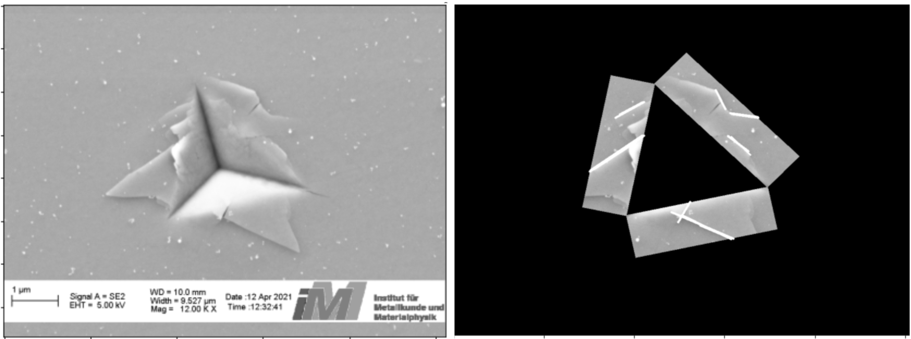

# Line detection around indentation marks
This package aims at detecting [slip lines](https://en.wikipedia.org/wiki/Slip_bands_in_metals) around indentation marks formed in mechanical testing of materials. To detect line segments using Opencv we found it easier to first detect/segment away the indentation mark from images. This helps localize the regions of ineterst on the edges of the indentation mark where the slip lines usually appear.

The [indent segmentation](https://github.com/oekosheri/line_detection_around_indent_marks/tree/main/indent_segmentation) runs a semnatic segmentation model on high performance computing cluster (HPC) with the goal of finding the best model to detect the indent mark. For details of this part I refer you to its corresponding [README](https://github.com/oekosheri/line_detection_around_indent_marks/tree/main/indent_segmentation/README.md).


## Create the right environment
The first step to use the line dtection code is to create the needed environment:
```
conda env create -f environment.yml
conda activate tensorflow-opencv2
```
## Run line detection
You could run the line detection file either locally or on the computer cluster.
To run it in a Terminal (ex. Linux), frist edit [run_detect_line.sh](./run_detect_line.sh) and change the address to the input image and the best model. Then run the file:
```
zsh ./run_detect_line.sh
```
or directly run the python file [detect_slip_lines.py](detect_slip_lines.py) with its input arguments.

The only function whose parameters need changing until you get the lines of interest is [detect_lines](https://github.com/oekosheri/line_detection_around_indent_marks/blob/904bec8f5b3efc277bf20d005a0350e0ee77f460/detect_slip_lines.py#L127-L214) for which a detailed docstring was written.
After running this file an image with detected lines on regions of interest will appear and the line coordinates and slopes will be written to a text file.

Alternatively, the line detection can also be run via this [Jupyter notebook](post_processing.ipynb) that shows how to run the algorithm step by step.

Below you will see an example after line detection. On the left you have the input image and on the right image after line detection on the regions of interest around the indent mark. To get more/less lines adjust the parameters to the function listed above.




## Acknowledgement
This project was done as part of the community education initiative within [NHR4CES](https://www.nhr4ces.de/).


