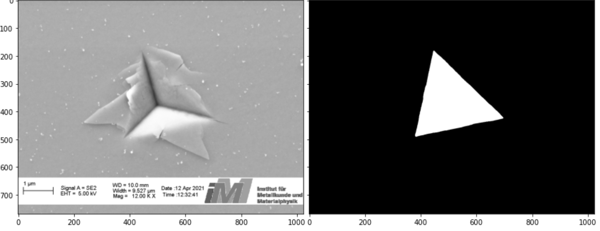

## Segmentation of indent marks
In this section a semantic segmentation model based on the Unet algorithm will be used to segment the indentation marks. The data, including images and masks, that were used for training is available as open data [here](). Images are gathered from different scanning electron microscopes at RWTH University IMM department.

Training and submission scripts have been prepared for use on an HPC cluster (In this case [RWTH University ITC]()). To find the best model, we submitted multiple jobs with different input arguments, in other words we ran a grid search.

To run the submission files as is, simply run:
```
zsh submission.sh
```
For each job a directory will be created which contains submit files, output files, log files and models.

You can edit the grid to be searched in [submission file](submission.sh), [run_file](run_file.sh]), [sub_file](sub_file.sh]) and finally by input arguments in [training file](training.py).

### GPU paralellization

Aside from data and model parameters, there is a GPU number parameter in the grid search, which allows you to run the code on multiple GPUs on 1 node(machine), as the underlying Tensorflow training file uses the Tensorflow's [Mirrored strategy](https://www.tensorflow.org/api_docs/python/tf/distribute/MirroredStrategy). To get the maximum benefit from speeding up, you can set the GPU number to the maximum GPU number of your HPC machines with minimal performance decrease.

### Results

The [Post_output](post_output) file created during submission and running the training, writes the metrics of the model for each set of parameters used. The current file shows the metrics from our run on our HPC cluster at [RWTH ITC](https://help.itc.rwth-aachen.de/). Each node has two GPUs on our cluster. The results show a minor decrease in metrics when two GPUs are used but the training time is almost halved.
We also noticed repeating the training dataset increases the performance (count parameter), however augemntation as we implemented it (brighness/contrast change), did not help the performnce of the model.

Below you will see the performance of the best model according to [post_output](post_output):




